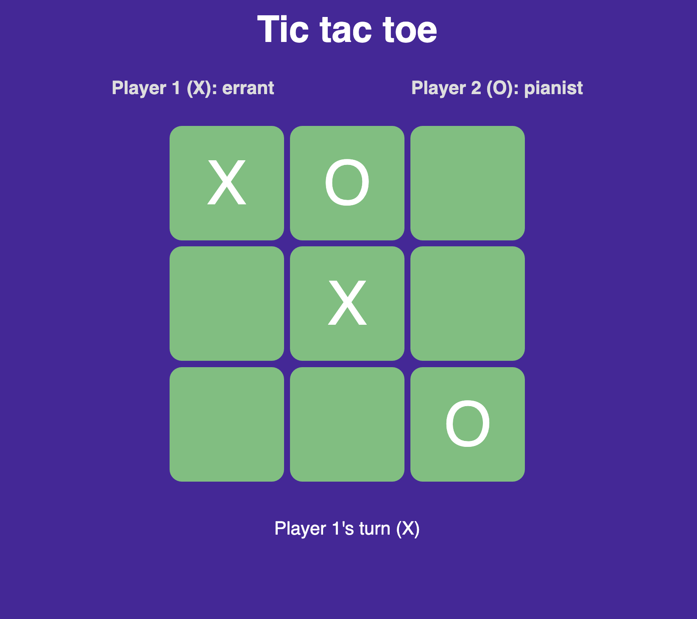

    

<h2 align="center">Tic tac toe</h2>

  

  For a game of noughts and crosses
  

   
  <a href="https://errantpianist.github.io/odin-tic-tac-toe/">View Demo</a>
  

 

## Preview

 

### Built With

- 
- 
- 

## Features

- A classic tic tac toe game implemented using pure HTML/CSS/JS
- Name entry using a smooth invisible modal

 

## Outcome

- Used CSS3 **grid** and **flex** to manage layout
- Used IIFEs to create separate modules

 

## What I learned

- Use of **Javascript** IIFEs to modularise code
- Using multiple layers of modal to force a progression through inputs

 

## Reflections

This was a fun project to work on. I experimented with using 2 modals on page load that disappear after inputting data and pressing enter. (I always wondered how they achieved this effect on more modern user-friendly websites.)

One bug that I encountered was not noticing that I'd used "" in some places and " " in others. This caused a lot of weird behaviour, but is now fixed. Don't use spaces in quotes, folks!

 

## Acknowledgments

- Thanks to [The Odin Project](https://www.theodinproject.com/) for putting together such an extensive open-source curriculum!
   

<!-- CONTACT -->

## Author

